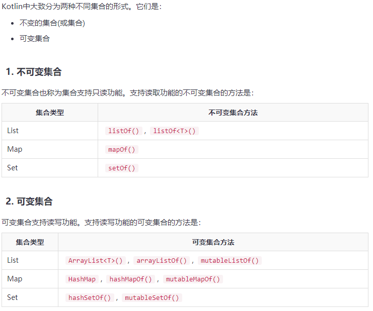
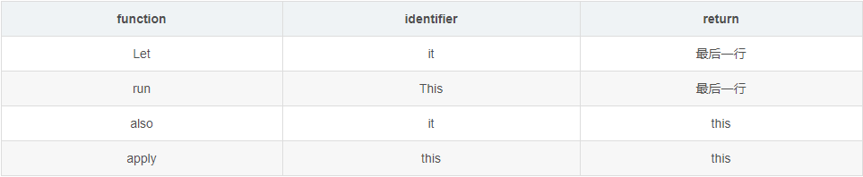
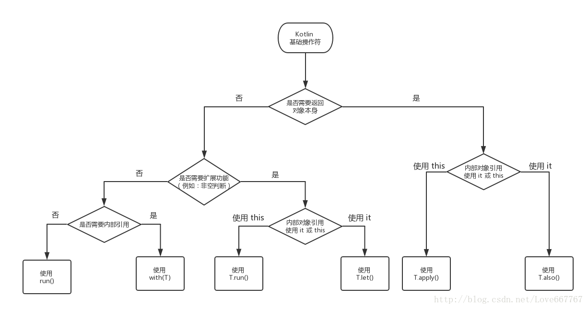

# 一、协程（Coroutine）
**参考**<br>
[Kotlin协程笔记](https://www.jianshu.com/p/8dc8abca50e3)
```
GlobalScope.launch(Dispatchers.Main) {
    MyLogger.e("run start11111")
    val name = async(Dispatchers.IO) {
        getName()
    }
    val sex = async(Dispatchers.IO) {
        getSex()
    }
    val age = async(Dispatchers.IO) {
        getAge()
    }
    MyLogger.e("run start22222")
    val info = name.await() + sex.await() + age.await()
    MyLogger.e("info-->$info")
    ToastUtil.getInstance().showToast(info)
}

suspend fun getName():String{
    delay(1000)
    MyLogger.e("name-->liuhuajian")
    return "liuhuajian"
}        
```
**三种启动方式**
1. runBlocking:T     

2. launch:Job

3. async/await:Deferred

# 二、集合



# 三、常用for循环
**遍历1-100的数值，包括1和100**
```
for (index in 1..100){
            print(index)
        }
```
**倒序遍历**
```
for (index in 100 downTo 1){
            print(index)
        }
```
**更改遍历的步长**
```
 for (index in 1..100 step 2){
            print(index)//会输出1..3..5......
        }
```
**不包含末尾元素**
```
for (index in 1 until 10){
            println(index)//输出0..9
        }
```
**遍历一个数组/列表，想同时取出下标和元素**
```
 val array = arrayOf("a", "b", "c")
        for ((index,e) in array.withIndex()){
            println("下标=$index----元素=$e")
        }
```
**遍历一个数组/列表，只取出下标**
```
val array = arrayOf("a", "b", "c")
        for (index in array.indices){
            println("index=$index")//输出0，1，2
        }
```
**遍历取元素**
```
val array = arrayOf("a", "b", "c")
        for (element in array){
            println("element=$element")//输出a,b,c
        }
```

# 四、基础操作符
### 关键字返回值

```
1. run、with、let、also、apply 的比较 
2. takeIf、takeUnless、repeat 的使用 
3. 异常类的使用
```


### 一元操作符
操作符|函数
-----|------
!a | a.not()
a++ | a.inc()
a-- | a.dec()

### 二元操作符
操作符|函数
-----|------
a + b | a.plus(b)
a - b | a.minus(b)
a * b | a.times(b)
a / b | a.div(b)
a % b | a.mod(b)

### 构造函数
主构造函数、次构造函数、init初始化

# 五、关键字使用
### [object](https://blog.csdn.net/xlh1191860939/article/details/79460601)
1. 对象声明（Object Declaration）(单例模式)<br>
**原理**：object declaration的类最终被编译成：一个类拥有一个静态成员来持有对自己的引用，并且这个静态成员的名称为INSTANCE，当然这个INSTANCE是单例的，故这里可以这么去使用。
2. 伴生对象（Companion Object）<br>
companion object {}中用来修饰 静态常量，或者静态方法，单例等等
伴生对象可以理解为内部类
3. 对象表达式（Object Expression）


## 总结：
1. apply和run的区别：apply返回<font color="#f00">对象本身</font>，而run返回最后一行的值，场景不同
2. 集合数组可以使用last()获取最后一个对象，例如<br>
```
mLampEffectSet.takeIf { it.isNotEmpty() }?.run {
            return lampEffect.level <= last().level && last().level != -1
        } ?: return true
```
3. 如何在不使用if进行条件判断，即链式处理
```
item.info.optString("itemid")?.apply {
            //itemid不为空的时候执行
        }.apply {
            //itemid为空的时候执行
        }
```
4. 如果有let、also这两个identifier为it的符号嵌套使用，怎么使用不同的层级的内容<br>
可以在方法体内添加data ->标识符，使用data变量
```
                    recyclerview_recommond?.getmNewsAdapter()?.data?.let {
                        data ->
                    }

                    错误示范：
                    recyclerview_recommond?.getmNewsAdapter()?.data?.run {
                        data ->
                    }
```
run、apply、let、also这四种操作符，只有<font color="#f00">let 和also</font>可以使用