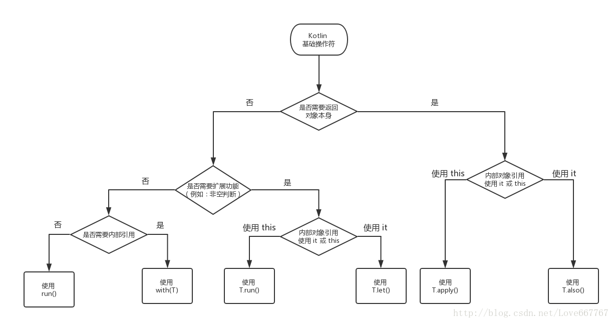

## 一、协程（Coroutine）

## 二、集合
可变集合和不可变集合
```
private var disposable = mutableListOf<Disposable>()

private var mNotifyStrokeData: List<NotifyStroke> = mutableListOf()
```
## 三、基础操作符
```
1. run、with、let、also、apply 的比较 
2. takeIf、takeUnless、repeat 的使用 
3. 异常类的使用
```


## 总结：
1. apply和run的区别：apply返回<font color="#f00">对象本身</font>，而run返回最后一行的值，场景不同
2. 集合数组可以使用last()获取最后一个对象，例如<br>
```
mLampEffectSet.takeIf { it.isNotEmpty() }?.run {
            return lampEffect.level <= last().level && last().level != -1
        } ?: return true
```
3. 如何在不使用if进行条件判断，即链式处理
```
item.info.optString("itemid")?.apply {
            //itemid不为空的时候执行
        }.apply {
            //itemid为空的时候执行
        }
```